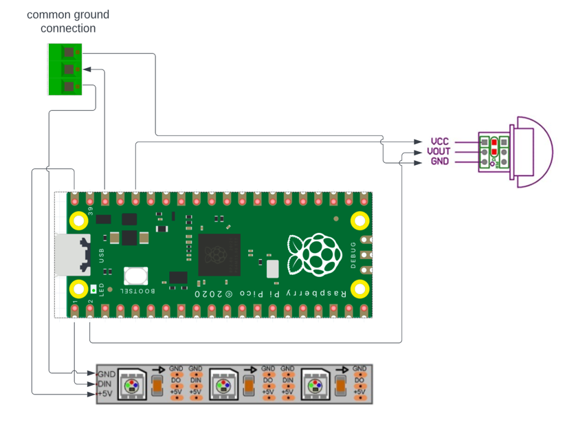

# raspberry-pi-pico-led-motion-detector

Parts List:
1. [Raspberry Pi pico](https://www.amazon.com/gp/product/B09437S9X4)
2. [ws2812b light strip](https://www.amazon.com/gp/product/B01CDTEG1O)
3. [AM312 Mini Human Sensor](https://www.amazon.com/gp/product/B08PVB7VHQ)
4. [USB Power Adapter](https://www.amazon.com/gp/product/B07T82D4YF)
5. [USB to mini USB cable](https://www.amazon.com/gp/product/B004GETLY2)
6. [Hobby box](https://www.amazon.com/gp/product/B073Y7RHQ4)
7. [Nylon nut and bolt](https://www.amazon.com/gp/product/B07XHW4613)
8. [3-pin connectors](https://www.amazon.com/gp/product/B01DC0KIT2)
9. [PCB Mount Screw Terminal Block Connectors](https://www.amazon.com/gp/product/B09F6TC7RP)
10. [PCB Board](https://www.amazon.com/gp/product/B07ZYPCXZ3)
11. [wire](https://www.amazon.com/gp/product/B01M0QTT7B)